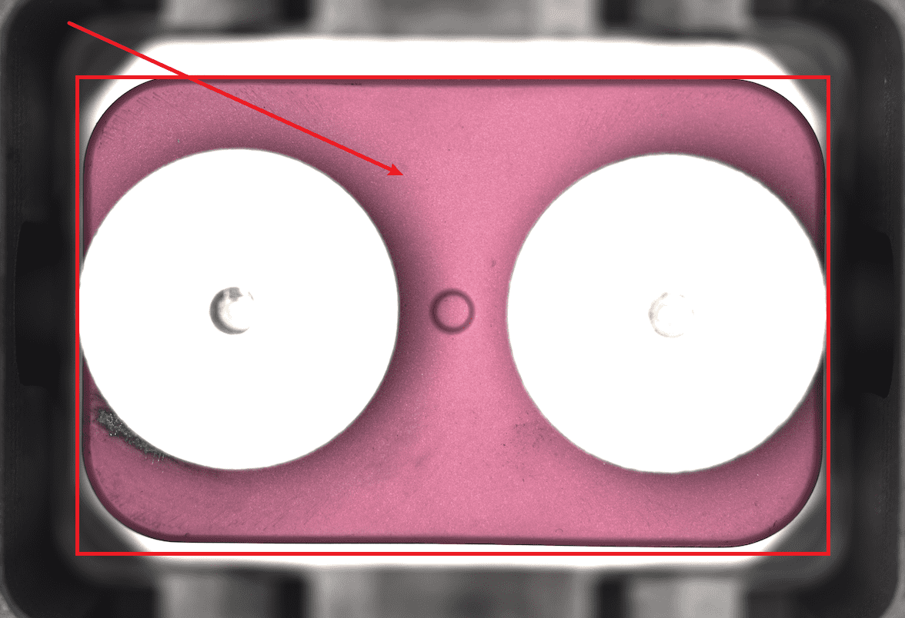
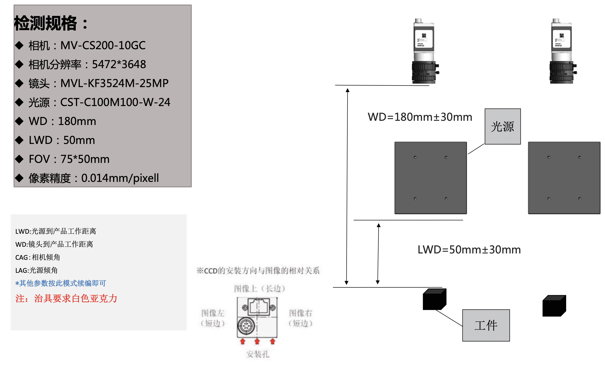

# 说明

## 对焦位置




## 架设示意图




已根据您的要求，在JSON格式中补充了缺陷区域在 `"shapes"` 字段中的标注方式，并优化了标签说明的结构：

## **图像标注规范**

### 标注工具
使用 **X-AnyLabeling** 进行标注。

### 标签类型说明

#### 1. 图像分类标签
用于描述图像整体状态，标注时**必须且仅能选择一项**：
- **整体合格（overall_ok）**  
- **当前区域不合格（current_region_ng）**  
- **其他区域不合格（other_regions_ng）**

#### 2. 缺陷区域标签（可选）
当图像标记为 `current_region_ng` 或 `other_regions_ng` 时，可在图像上标注具体缺陷区域。

**缺陷类型包括：**
- **当前区域缺陷**（标签以 `current_` 开头）
    - `current_scratch` – 划痕
    - `current_chip` – 崩边/缺口
    - `current_stain` – 污渍
- **其他区域缺陷**（标签以 `other_` 开头）
    - `other_scratch` – 划痕
    - `other_chip` – 崩边/缺口
    - `other_stain` – 污渍

### JSON 数据格式说明

#### 整体结构
```json
{
  "version": "...",
  "flags": { ... },
  "shapes": [ ... ],
  "imagePath": "...",
  "imageHeight": 3648,
  "imageWidth": 5472
}
```

#### 2.1 分类标签（flags字段）
分类标签记录在 `flags` 字段中，采用布尔值表示状态：
```json
{
  "flags": {
    "overall_ok": true,
    "current_region_ng": false,
    "other_regions_ng": false
  }
}
```

#### 2.2 缺陷区域标注（shapes字段）
缺陷区域信息记录在 `shapes` 数组中，每个缺陷区域为一个独立对象：
```json
{
  "shapes": [
    {
      "label": "current_chip",
      "points": [ ... ],
      "shape_type": "polygon",
    },
    {
      "label": "other_scratch",
      "points": [ ... ],
      "shape_type": "polygon",
    }
  ]
}
```

**字段说明：**
- `label`：缺陷类型标签（如 `current_chip`）
- `points`：多边形顶点坐标，标注缺陷的具体区域
- `shape_type`：标注形状类型，通常为 `"polygon"`

### 标签使用规则
1. **互斥原则**：`overall_ok` 与 `current_region_ng` 和 `other_regions_ng` 互斥
2. **缺陷标注条件**：仅当 `current_region_ng` 或 `other_regions_ng` 为 `true` 时，才可在 `shapes` 中
